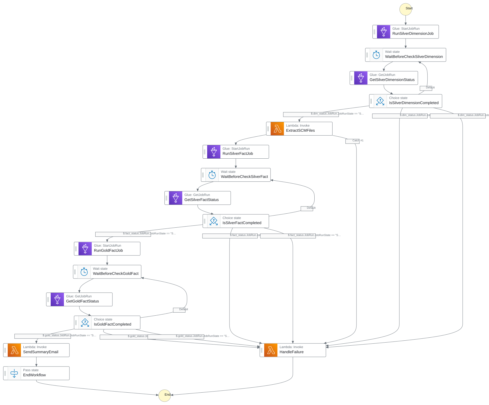
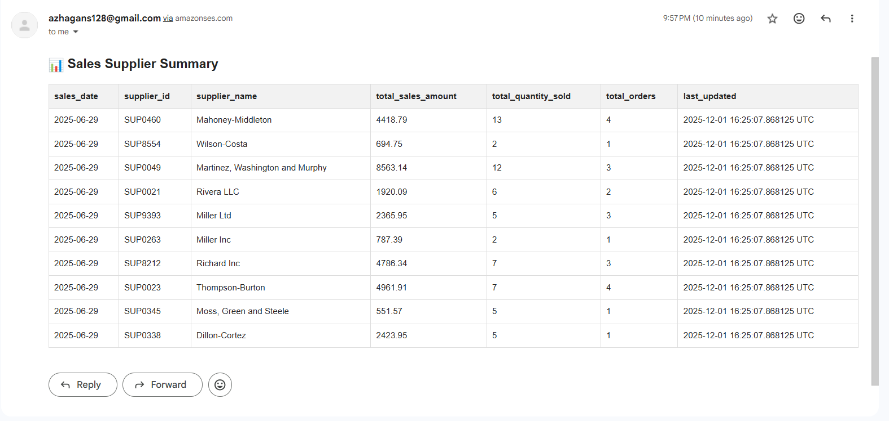

#  Supply Chain Analytics Platform (Medallion Architecture)

A modern supply chain analytics ecosystem built using **AWS**, **Apache Iceberg**, and **Snowflake** enabling real-time supplier visibility, inventory intelligence, and production planning insights.

---

## 🏗️ Architecture

### 🔄 Process Flow
The platform utilizes an event-driven architecture orchestrated by AWS Step Functions:

1.  **Ingestion:** Data files (SAP, SaaS, IoT) are uploaded to the **Amazon S3** Raw bucket.
2.  **Event Trigger:** **Amazon EventBridge** detects the upload and initiates the workflow.
3.  **Orchestration (Step Functions):**
    * **Validation:** **AWS Lambda** validates the file schema.
    * **ETL:** **AWS Glue** jobs transform data through Medallion layers (Bronze → Silver → Gold).
    * **Alerting:** **Amazon SNS** notifies on failure; **Amazon SES** emails summaries on success.
4.  **Storage:** Data is stored in **S3** (Iceberg format) and synced to **Snowflake** (Raw/Curated/Consumption).
5.  **Analytics:** **Amazon Athena** and **BI Tools** query the curated Gold layer for visualization.

---

## 🛠️ Tech Stack & Services

| Category | Service | Logo | Description |
| :--- | :--- | :---: | :--- |
| **Compute & ETL** | **AWS Glue** |  | Serverless ETL pipelines for Bronze/Silver/Gold processing |
| | **AWS Lambda** |  | Schema validation and lightweight compute triggers |
| **Orchestration** | **Step Functions** |  | End-to-end workflow management and error handling |
| **Storage** | **Amazon S3** |  | Data Lake storage backing Apache Iceberg tables |
| **Analytics** | **Snowflake** |  | Enterprise Data Warehouse for high-performance BI |
| | **Amazon Athena** |  | Ad-hoc SQL querying via ODBC connectors |
| **Events & Msg** | **EventBridge** |  | Event bus triggers for S3 object uploads |
| | **Amazon SNS** |  | Notification service for failure alerts |
| | **Amazon SES** |  | Email service for job summary reports |
| **Monitoring** | **CloudWatch** |  | Logs, metrics, and operational dashboards |

---

## 📊 Key Deliverables

* **Medallion Architecture:** Implemented Bronze (Raw), Silver (Cleansed), and Gold (Aggregated) layers using **Apache Iceberg** tables on S3.
* **Star Schema Modeling:** Designed Gold layer Fact/Dimension tables to support KPIs like Supplier On-Time Delivery and Inventory Aging.
* **Hybrid Storage:** Integrated **Snowflake** as the analytics warehouse while maintaining a cost-effective S3 Data Lake.
* **Automated Governance:** Used **AWS IAM** for security and **Lake Formation** for data governance.
* **Infrastructure as Code:** Automated provisioning using **Terraform**.

---

## 🏆 Business Impact

| Metric | Improvement |
| :--- | :--- |
| **Seamless Summary**  | ⚓ **Indenependent on Data Team** for Summary and Dashboards |
| **Reporting Latency** | 📉 **Reduced by 60%**, enabling real-time shipment monitoring |
| **Planning Accuracy** | 📈 **Improved by 45%** via IoT-driven stock forecasting |
| **Logistics Costs** | 💰 **Cut by 25%** through better delay tracking |
| **Stockouts** | 🛑 **Prevented** using predictive safety-stock alerts |

---

## 📬 Contact
For collaboration or queries, feel free to open an issue.
